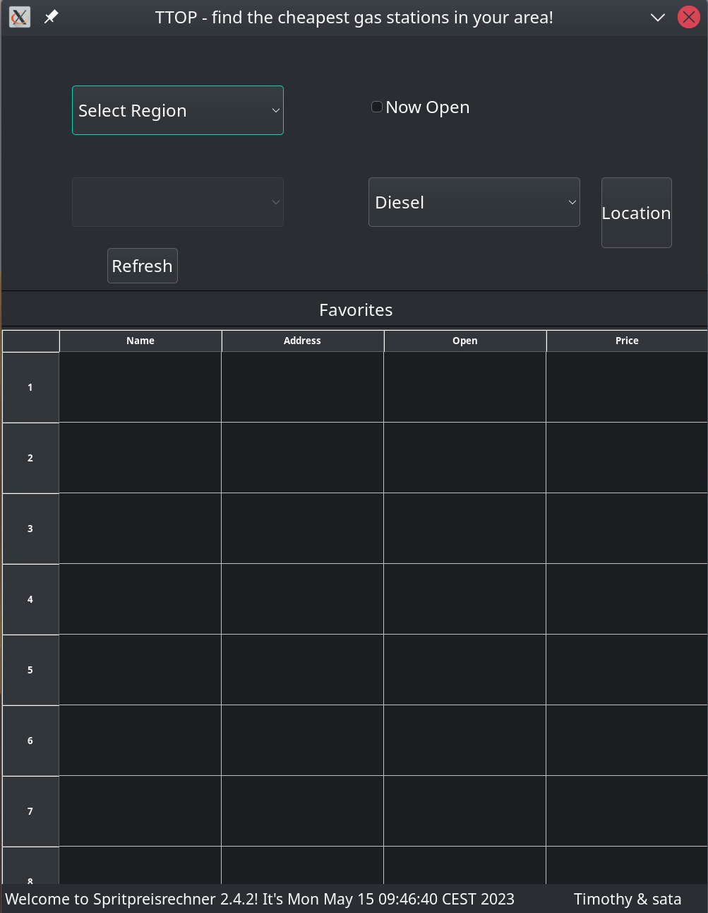
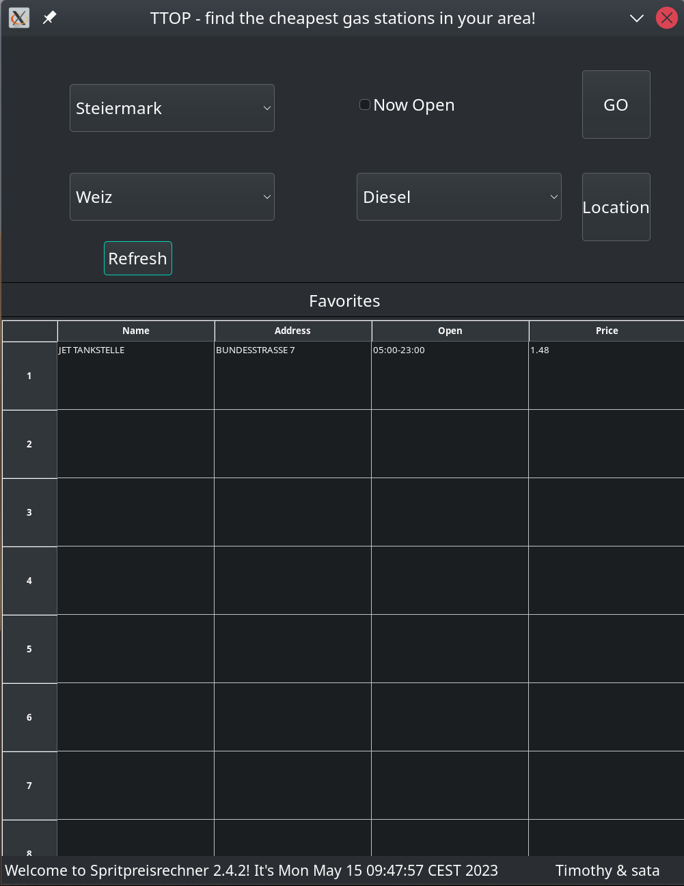
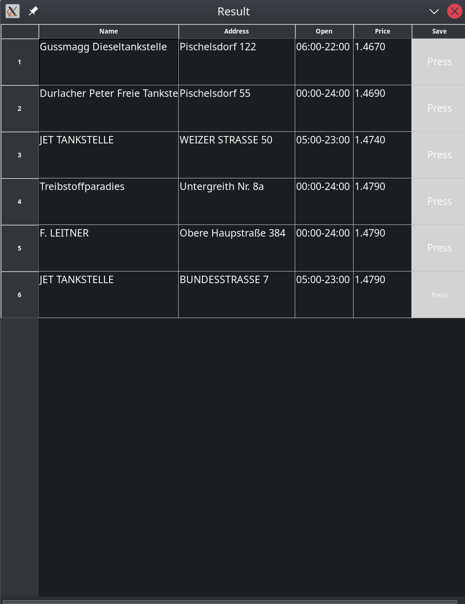

# ttop

`ttop` is a WX Desktop Application to help you find cheap gas stations. It is using a public api from `https://www.e-control.at/`.
You can find it [here](https://api.e-control.at/sprit/1.0/doc/index.html?url=https://api.e-control.at/sprit/1.0/api-docs%3Fgroup%3Dpublic-api#/ping/pingUsingGET_3).

# Screenshots





# Dependecies

In order to compile and run ttop, you will need the following dependencies:

- wxWidgets: A C++ library that lets developers create applications for Windows, macOS, Linux and other platforms with a single code base. It has native look and feel, and it's extensible with a variety of features. Install it with wx-config.
- libcurl: A free and easy-to-use client-side URL transfer library, supporting DICT, FILE, FTP, FTPS, Gopher, HTTP, HTTPS, IMAP, IMAPS, LDAP, LDAPS, POP3, POP3S, RTMP, RTSP, SCP, SFTP, SMB, SMTP, SMTPS, Telnet and TFTP. libcurl supports SSL certificates, HTTP POST, HTTP PUT, FTP uploading, HTTP form based upload, proxies, cookies, user+password authentication (Basic, Digest, NTLM, Negotiate, Kerberos), file transfer resume, http proxy tunneling and more!
- jsoncpp: A C++ library for interacting with JSON.
- SQLite3: A C library that provides a lightweight disk-based database that doesn’t require a separate server process and allows accessing the database using a nonstandard variant of the SQL query language. Some applications can use SQLite for internal data storage.
- wxNet: A library for network programming that provides classes for working with sockets, internet protocols (like HTTP, FTP), and network services (like DNS resolution).

These dependencies can be installed on Ubuntu using the following commands:


```sh
sudo apt-get update
sudo apt-get install libwxgtk3.0-dev libcurl4-openssl-dev libjsoncpp-dev sqlite3 libsqlite3-dev
```

You can then clone this repository and compile the project with make.

Run it with

```
./ttop
```


## Lizenz

This project is licensed under the MIT License. See the [LICENSE](LICENSE) file for details.

